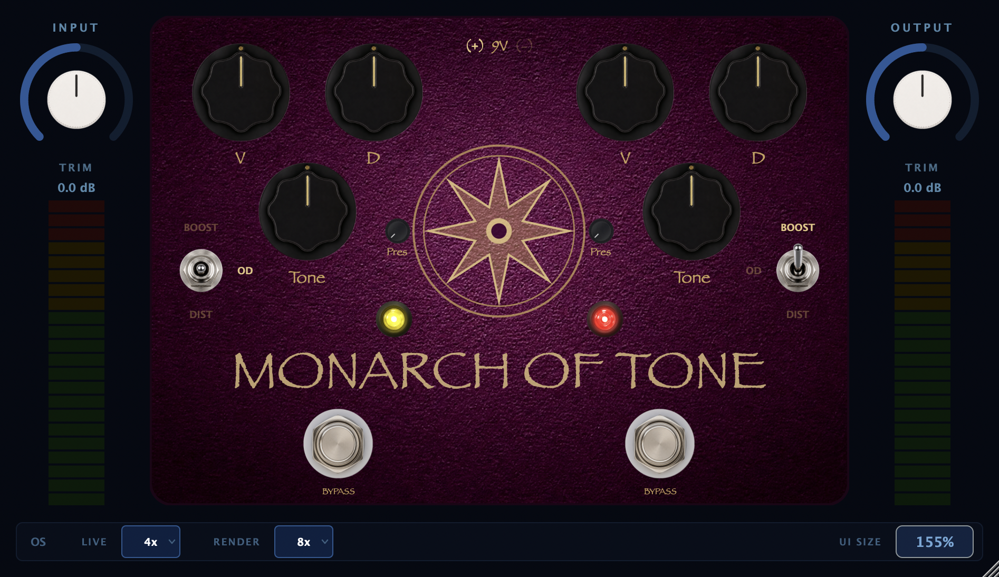

# Monarch of Tone

A circuit-accurate, dual-channel overdrive plugin (AU/VST3, JUCE 8) modelled directly
from the schematic of a boutique two-in-one Bluesbreaker-derived pedal — the kind of
"holy grail" overdrive that's notoriously hard to get hold of and even harder to clone by ear.
Monarch of Tone isn't a vibe-matched approximation: every gain stage, filter pole, and diode
pair is solved as a Wave Digital Filter from real component values, then calibrated against
NAM captures of a real unit until the plugin's output nulls against the hardware's.



## What it is

Two independent overdrive channels, wired in series exactly as in the original hardware,
each with its own Volume, Drive, Tone, and Presence, three clipping modes (Boost / Overdrive /
Distortion), and its own bypass footswitch. The first channel ("Yellow") is the stock circuit;
the second ("Red") carries a fixed Hi-Gain mod, so the two channels stack from a clean boost
all the way to a hot, high-gain double-overdrive — the entire reason the original two-in-one
design is prized.

- **Dual channels in series** (Yellow → Red), each independently bypassable
- **3 clipping modes per channel** — Boost (clean, op-amp-rail limited), Overdrive (soft
  feedback clipping), Distortion (hard shunt clipping) — matching the real 3-position toggle mod available for the pedal.
- **Red channel Hi-Gain mod** baked in as a fixed, non-toggleable voicing, just like the
  hardware mod it's based on
- **Supply-voltage mod (9V / 12V / 18V)** — simulates running the pedal on a hotter supply:
  more op-amp headroom (mostly audible in Boost), diode clipping thresholds untouched, exactly
  mirroring what the real "18V mod" does to the hardware
- **Per-channel Presence trim**, independent Input/Output trim (±12 dB) with VU metering for
  studio gain-staging
- **Switchable oversampling** — separate Live (default 4x) and Render (default 8x) settings,
  the render path auto-engaging when your DAW bounces

## Under the hood

The whole signal path is modelled with [chowdsp_wdf](https://github.com/Chowdhury-DSP/chowdsp_wdf)
Wave Digital Filters, in double precision, with absolute circuit voltages (not normalized
±1.0) so that every nonlinearity clips at the *real* voltage it would in the hardware:

- **Stage 1** (non-inverting gain stage) and **Stage 2** (inverting ×−22 gain stage) are each
  solved from the real R/C feedback network — no generic biquad stand-ins.
- **Soft-clip and hard-clip stages** are true symmetric diode pairs (MA856 soft, 1S1588 hard)
  solved via Newton-Raphson / Wright-Omega, not waveshaper lookup tables.
- **The Tone stage** is a 3-terminal pot tap solved as an R-type WDF adaptor at the wiper —
  not two independent EQ branches glued together.
- **Op-amp rail saturation** (±3.3V, soft knee) makes Boost mode clip the way the real op-amp
  does at the top of its swing, with **first-order antiderivative antialiasing (ADAA)** on that
  knee so the saturation doesn't alias even at low oversampling.
- **Even-harmonic content** the symmetric topology can't produce on its own is reintroduced
  the way the real device's second-order physics would, gated so a clean signal stays clean.

All of this was checked, not assumed: every component value was cross-referenced across two
independent schematic sources, every discrepancy is logged with its resolution, and the
**stock circuit was directly A/B'd against NAM captures of a real King of Tone**. After
sub-sample time alignment and per-mode level matching, the plugin **nulls against the real
pedal by −8.5 to −18.8 dB** across a 25-capture sweep spanning all three clipping modes, the
full drive range, and tone settings — with the tone control's behavior under drive matching
flat across the entire sweep. The remaining residual is concentrated at the captures' own
aliasing/noise floor at extreme drive, not in the model. See `analysis/` for the harness and
`CLAUDE.md` Step 11 for the full validation log.

## Building

**Requirements:** CMake 3.15+, a C++17 compiler. AU + VST3 + Standalone on macOS 10.13+; VST3 +
Standalone on Windows and Linux (see Known Limitations).

```bash
git clone <this-repo>
cd MoT

# Pull in dependencies (JUCE 8, chowdsp_wdf, xsimd)
git submodule update --init --recursive
# or, if adding fresh:
git submodule add https://github.com/juce-framework/JUCE libs/JUCE
git submodule add https://github.com/Chowdhury-DSP/chowdsp_wdf libs/chowdsp_wdf
git submodule add https://github.com/xtensor-stack/xsimd libs/xsimd

# Configure and build
cmake -B build -DCMAKE_BUILD_TYPE=Release
cmake --build build --target Monarch_AU       # Audio Unit (macOS only)
cmake --build build --target Monarch_VST3     # VST3 (macOS/Windows/Linux)
cmake --build build --target Monarch_Standalone
```

The build also produces a handful of standalone diagnostic targets used during development —
not required for normal use, but handy if you're poking at the DSP:

| Target | What it does |
|--------|--------------|
| `UISnapshot` | Headless render of the plugin editor to a PNG — no display needed |
| `PedalRender` | Renders a WAV file through the real processor at given control settings, for A/B against a capture |
| `ControlSweep` | Drives every control through its full range across all clip-mode combinations and OS factors, checking for NaNs/instability |
| `Stage1_FreqResponse`, `Stage2_Gain`, `SW1SoftClip_Sine`, `SW2HardClip_Sine`, `ToneStage_FreqResponse`, `VolumePot_Taper`, `Stage1_HiGain`, `FullChain_DualChannel`, `SmokeTest_RC` | Per-stage DSP correctness tests (see `tests/`) |

## Where to find things

```
src/
  PluginProcessor.{h,cpp}   Top-level AudioProcessor, APVTS parameter layout, processBlock
  PluginEditor.{h,cpp}      Top-level editor: peripheral shell (trim/VU/oversampling strip)
  dsp/                      One file per circuit stage (Stage1, Stage2, SW1SoftClip,
                             SW2HardClip, ToneStage, VolumePot) + MonarchChannel, which
                             wires a full channel together and is instantiated twice
  ui/                       PedalFace (the pedal-face graphics) and the shared LookAndFeel,
                             VU meter, LED, clip switch, and voltage-selector components
  utils/TaperUtils.h        Pot taper math (linear vs. audio)

tests/        Per-stage DSP validation programs (see table above)
tools/        Diagnostic/offline executables (PedalRender, ControlSweep, UISnapshot) plus
              the R-type scattering-matrix solver used to derive Stage 1/2's WDF adaptors
analysis/     Real-pedal NAM captures, the v2 test signal that drives them, and the Python
              reference-validation suite: gen_test_signal.py (signal), analyze.py (Farina-ESS
              frequency response + THD-by-band + harmonics + IMD + dynamics), null_test.py
              (sub-sample-aligned null depth), run_validation.py (renders the plugin at every
              capture's settings and emits VALIDATION_REPORT.md), and internal_checks.py
              (volume/knob/sample-rate/aliasing behaviour for the axes captures don't cover)
.claude/rules/   Living technical specs — circuit topology (circuit.md), DSP implementation
                 rules (dsp.md), plugin architecture (architecture.md), UI layout (ui.md),
                 and build setup (build.md). These are the project's source of truth for
                 "why does the code do it this way" — read them before changing DSP code.
CLAUDE.md     Project memory: build sequence, decisions, and the full validation log
```

## Releasing

Two GitHub Actions workflows live in `.github/workflows/`:

- **`ci.yml`** — on every push to `main` and every PR, builds the plugin (AU+VST3 on macOS,
  VST3 on Windows/Linux) and runs every DSP validation test in `tests/` on all three platforms.
- **`release.yml`** — on pushing a tag like `v0.7.0` (or manual dispatch), builds release
  binaries on macOS/Windows/Linux and publishes a GitHub Release with one zip per platform:
  `Monarch-of-Tone-<version>-macOS.zip` (AU + VST3), `-Windows.zip` (VST3), `-Linux.zip` (VST3).
  The version number is read from `CMakeLists.txt`, not the tag, so they can't drift apart.

**macOS code signing/notarization** runs automatically once these repo secrets are set
(Settings → Secrets and variables → Actions); until then the macOS zip ships **unsigned** and
the workflow logs a warning instead of failing:

| Secret | What it is |
|--------|-----------|
| `APPLE_CERT_P12_BASE64` | `base64 -i DeveloperIDApplication.p12` of your exported Developer ID Application cert |
| `APPLE_CERT_PASSWORD` | Password the `.p12` was exported with |
| `APPLE_SIGNING_IDENTITY` | e.g. `Developer ID Application: Leigh Pierce (TEAMID)` |
| `APPLE_TEAM_ID` | Your 10-character Apple Developer Team ID |
| `APPLE_ID` | Apple ID email used for notarization |
| `APPLE_APP_SPECIFIC_PASSWORD` | An [app-specific password](https://support.apple.com/en-us/102654) for that Apple ID (not your main password) |

## Known limitations

- **AU is macOS-only** (an Apple plugin format) — Windows and Linux builds ship VST3 +
  Standalone. macOS ships AU + VST3 + Standalone.
- Diode-stage ADAA (as opposed to the rail-saturation ADAA already implemented) is deferred:
  the clipping stages are solved as WDF nonlinear *roots*, not memoryless waveshapers, and
  `chowdsp_wdf` doesn't have ADAA support for that case. 8x oversampling on render is judged
  sufficient in the meantime.
- A few device-physics-level residuals versus the real pedal (very-high-drive compression
  depth, some high-frequency content above the captures' own alias floor) are accepted as
  capture/device limits rather than model errors — see `CLAUDE.md` Step 11 for specifics.

## Roadmap

- **0.7 (current)** — VST3 wired up cross-platform (macOS/Windows/Linux), CI build+test on
  every push, and a tagged-release pipeline producing a signed/notarized macOS zip plus
  Windows and Linux VST3 zips.
- **0.8 (in progress)** — A full reference-validation pass against real-pedal captures. The
  Python suite is built (`analysis/`): a v2 test signal (cal tone, clean + 3-level driven
  log-sweeps, dense tones through 1–8 kHz, twin-tone IMD, decaying notes), Farina-ESS
  deconvolution for continuous 20 Hz–20 kHz frequency response and THD-by-band, harmonic
  profile / odd-even split, IMD, dynamic (touch-sensitivity) response, and a null-depth
  orchestrator across all captures that writes `analysis/VALIDATION_REPORT.md`. **Pending:** the
  user re-captures the real pedal with the v2 signal, after which the report's achieved
  null-depth figures land here. Internal checks (volume taper/tone-invariance, knob
  monotonicity, sample-rate consistency, aliasing) already pass — note that volume, presence,
  and the Red channel have **no varied-setting hardware reference** (the captures are all at
  fixed volume=noon, presence=min, Yellow only), so those are validated for correct behaviour
  rather than bit-matched to hardware. Also: finish Apple signing/notarization if not already on.
- **0.9 (TODO)** — Factory presets.
- **1.0 (TODO)** — Simple installers per platform. JUCE itself only builds the plugin/app
  binaries, not installers — but since the project already builds with CMake, the plan is to
  add a `CPack` config to `CMakeLists.txt` and let its built-in generators wrap the native
  tooling: `productbuild`/`pkgbuild` on macOS, WiX or NSIS on Windows, DEB on Linux. Last item
  on the roadmap; the per-platform zips remain the distribution method until this lands.

## Thanks

Built on the shoulders of:

- [JUCE](https://juce.com) — the plugin framework
- [chowdsp_wdf](https://github.com/Chowdhury-DSP/chowdsp_wdf) — Wave Digital Filter library
  that made circuit-accurate modelling tractable
- [xsimd](https://github.com/xtensor-stack/xsimd) — SIMD acceleration

## License

This project is licensed under the [GNU Affero General Public License v3.0](LICENSE)
(AGPLv3), the same license under which the open-source edition of JUCE is distributed.
chowdsp_wdf and xsimd are compatible and included under their own license terms in `libs/`.

## Author

Leigh Pierce
